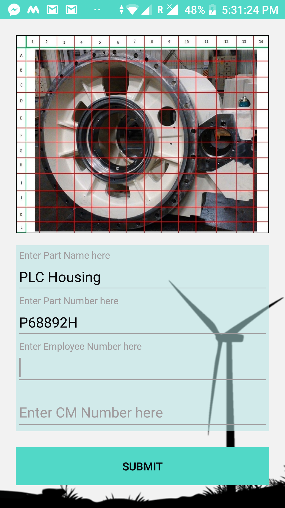
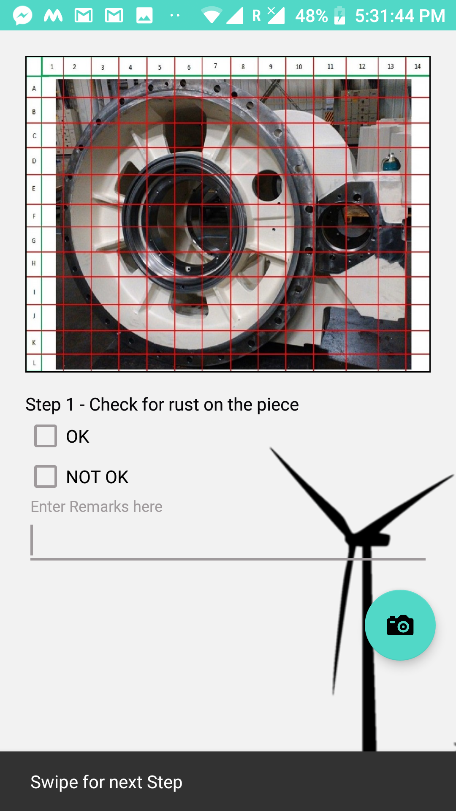
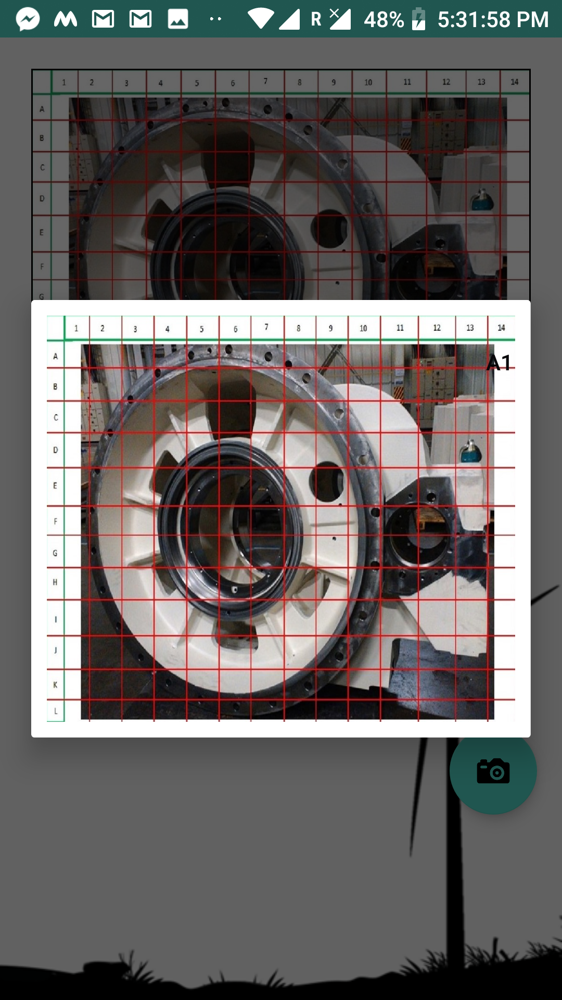
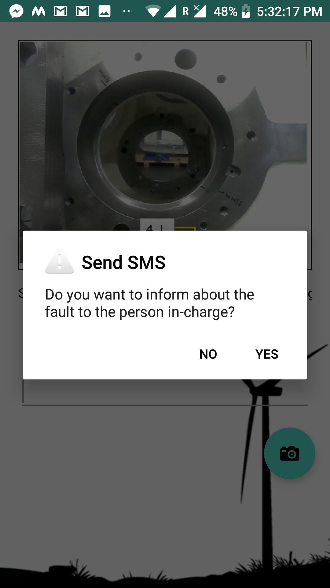
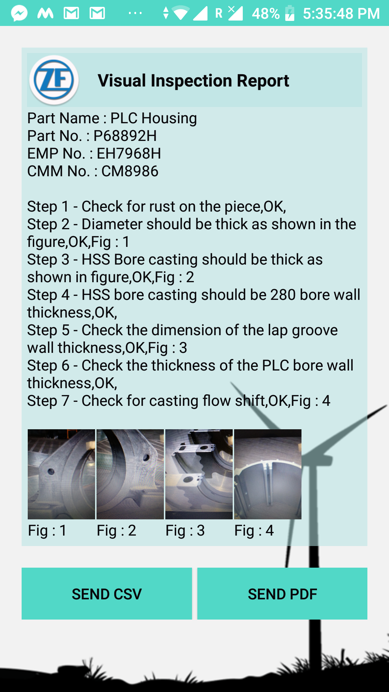
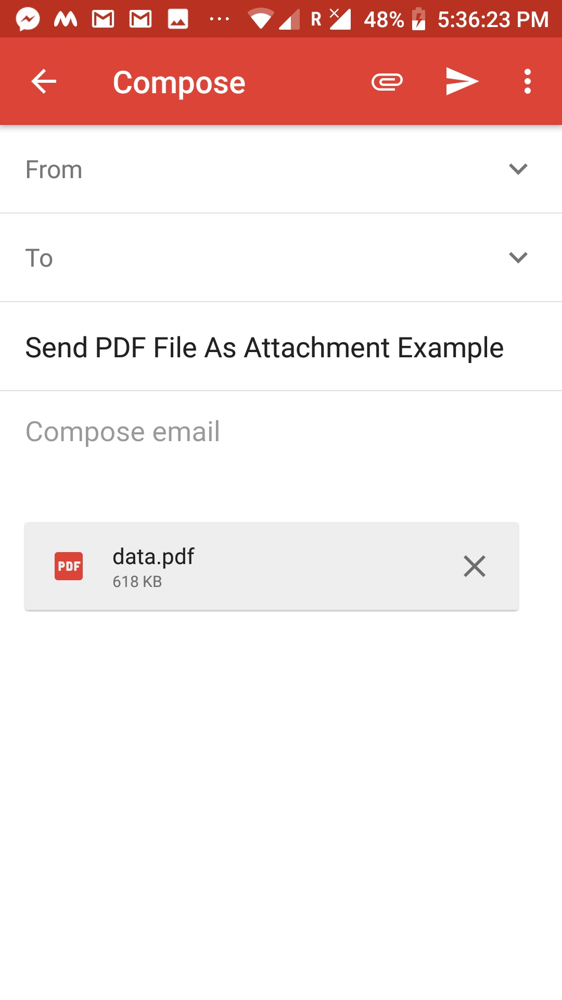
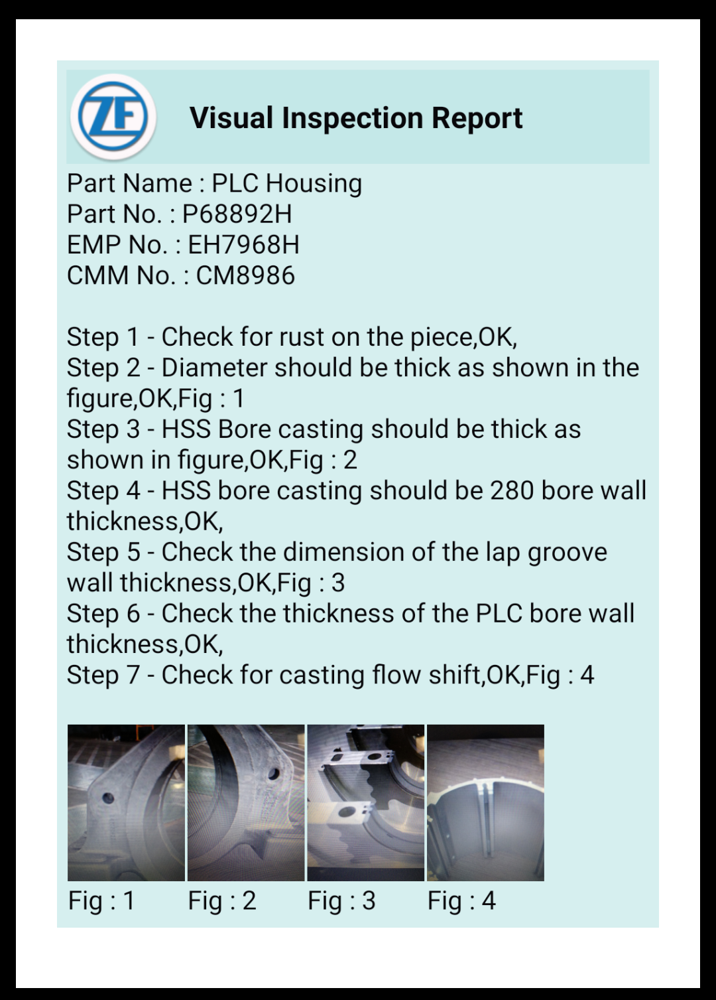

# Visual Inspection Reporter
This is an **android app** that I created for a wind turbine manufacturer in **Android Studio** to automate their Visual Inspection Report of their manufactured parts.
The app does the following functions
* Creates the report in **.csv** or **.pdf** format
* Takes **pictures** of the fault whenever necessary and saves it along with the pdf file generated.
* Can **send SMS** to the required people whenever the inspector comes across an issue.
* Helps in **selecting a location of the part**(which is given in a grid format) and enters it in remarks to inform the exact position.
* Able to **share the file** genarated in an for i.e. via. mail, whatsapp etc

## Screenshots
* Home Screen of the app

* Steps screen of the app

* For the first step if "Not Ok" is clicked it opens a dialog box with the image in the grid. It helps the inspector in locating the position of the rust by just clicking the image ast the right position. The position will then get updated in the remarks box

* When inspector enter "Not Ok" and goes to the next step it opens a dialog box asking whether he has to send a message to the supervisor with the points in the remarks text box.

* Final display screen. From where we can share the report either as csv of pdf formats

* Email sharing screen

* Final sample report generated by the app

